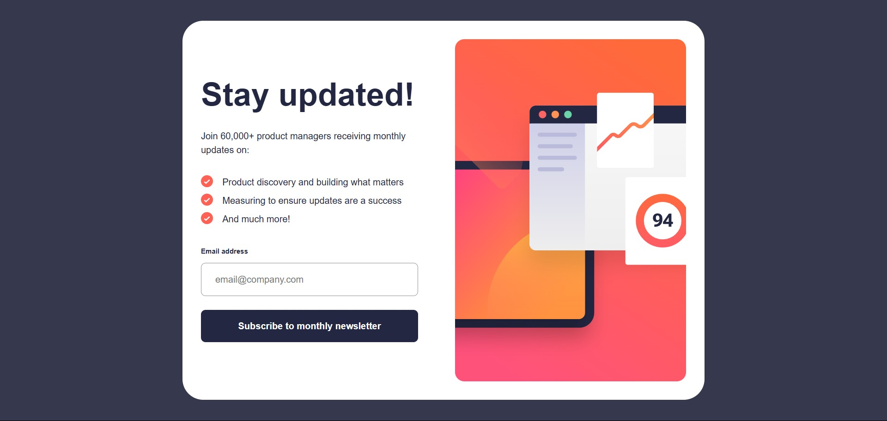

# Frontend Mentor - Newsletter Sign-up Form with Success Message Solution

This is my solution to the [Newsletter sign-up form with success message challenge on Frontend Mentor](https://www.frontendmentor.io/challenges/newsletter-signup-form-with-success-message-3FC1AZbNrv). The goal of this challenge was to build a fully responsive newsletter subscription form with client-side validation, accessibility support, and a success state.

## Table of contents

- [Overview](#overview)
  - [The challenge](#the-challenge)
  - [Screenshot](#screenshot)
  - [Links](#links)
- [My process](#my-process)
  - [Built with](#built-with)
  - [What I learned](#what-i-learned)
  - [Continued development](#continued-development)
  - [Useful resources](#useful-resources)
  - [AI Collaboration](#ai-collaboration)
- [Author](#author)

---

## Overview

### The challenge

Users should be able to:

- Submit their email address using the newsletter form.
- Receive a personalized success message after successful submission.
- See validation feedback when:
  - the email field is empty;
  - the email address is incorrectly formatted.
- View an optimized layout across different screen sizes.
- Interact with accessible hover and focus states.

### Screenshot



### Links

- Solution URL: [https://github.com/runny-life/newsletter-sign-up-with-success-message](https://github.com/runny-life/newsletter-sign-up-with-success-message)
- Live Site URL: [https://runny-life.github.io/newsletter-sign-up-with-success-message/](https://runny-life.github.io/newsletter-sign-up-with-success-message/)

---

## My process

### Built with

- Semantic HTML5
- CSS Custom Properties
- Flexbox
- CSS Grid
- Mobile-first workflow
- Vanilla JavaScript (ES6+)
- BEM naming convention
- Accessibility best practices (ARIA, focus management, semantic markup)

---

### What I learned

This project helped me reinforce several important frontend development concepts.

Some of the key takeaways were:

- Building semantic and accessible HTML structure.
- Using a mobile-first workflow for responsive layouts.
- Organizing CSS with reusable custom properties.
- Creating responsive layouts with Flexbox and CSS Grid.
- Managing UI state using the `hidden` attribute.
- Implementing client-side form validation using the browser's built-in Validation API instead of regular expressions.
- Improving accessibility by managing focus and using ARIA attributes.

Example of using the built-in validation API:

```javascript
function isEmailValid() {
  return inputEmailElement.validity.valid;
}
```

Managing the success state:

```javascript
newsletterElement.hidden = true;
successElement.hidden = false;
```

---

### Continued development

In future projects I want to continue improving:

- Accessibility (WCAG)
- Writing scalable and maintainable CSS architectures
- JavaScript component organization
- Form validation patterns
- Performance optimization
- Automated testing

---

### Useful resources

- Frontend Mentor — [https://www.frontendmentor.io/](https://www.frontendmentor.io/)
- MDN Web Docs — [https://developer.mozilla.org/](https://developer.mozilla.org/)
- HTML Living Standard — [https://html.spec.whatwg.org/](https://html.spec.whatwg.org/)
- CSS Tricks — [https://css-tricks.com/](https://css-tricks.com/)

---

### AI Collaboration

AI was used as a development assistant rather than a code generator.

It helped me with:

- discussing semantic HTML structure;
- reviewing accessibility decisions;
- improving responsive layout architecture;
- choosing between Flexbox and CSS Grid;
- reviewing JavaScript organization;
- explaining best practices and modern frontend patterns.

All code was reviewed, adapted, and integrated manually.

---

## Author

- GitHub - [https://github.com/runny-life](https://github.com/runny-life)
- Frontend Mentor - [https://www.frontendmentor.io/profile/runny-life](https://www.frontendmentor.io/profile/runny-life)
